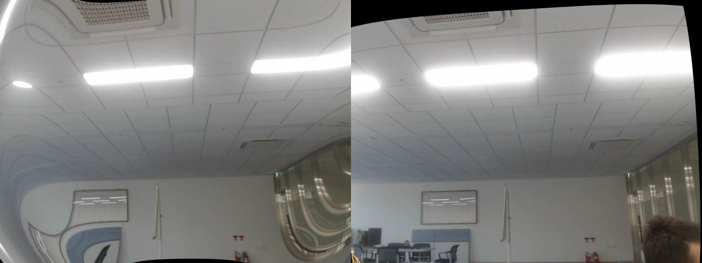
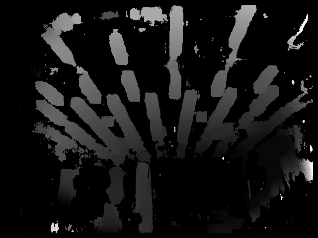
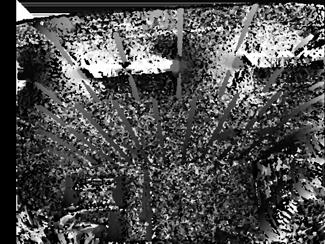

# Using OpenCV

Contains 3 codes

1. For rectification
2. For view alignment
3. For disparity Map

On testing with Middlebury Cones Example dataset the result was visually better compared to testing on live video image -

Middlebury Cone Disparity Map obtained

## Our Camera Input/Output on Live Stream

### Input Image

### Rectiifed Image

**Rectification matrices and Stereo Matrices calculated are stored in *stereo.npy***

### Disparity via Block Matching

### Disparity via Semi Block Matching

