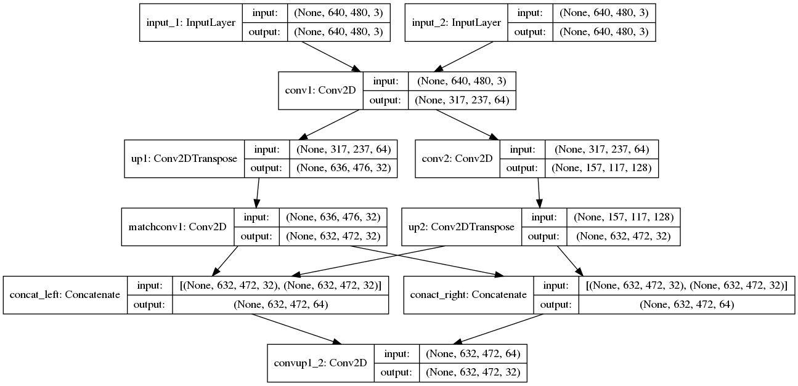

# iResNet keras implementation

> ## Work in Progress

### Stem Block for Multi-Scale Shared Feature Extraction

The keras output model for the first section of iResNet

| Type | Name | kernal size | stride | c I/O | Input |
| ---- | ---- | ----------- | ------ | ----- | ----- |
| Conv2D | conv1_left | 7 | 2 | 3/64 | left_image |
| Conv2D | conv1_right | 7 | 2 | 3/64 | right_image |
| Conv2DTranspose | up1_left | 4 | 2 | 64/32 | conv1_left |
| Conv2DTranspose | up1_right | 4 | 2 | 64/32 | conv1_right |
| Conv2D | conv2_left | 5 | 2 | 64/128 | conv1_left |
| Conv2D | conv2_right | 5 | 2 | 64/128 | conv1_right |
| Conv2DTranspose | up2_left | 8 | 4 | 128/32 | conv2_left |
| Conv2DTranspose | up2_right | 8 | 4 | 128/32 | conv2_right |
| Conv2D | match_conv1_left | 5 | 1 | 32/32 | up1_left |
| Conv2D | match_conv1_right | 5 | 1 | 32/32 | up1_right |
| Concat | up1_2_left | X | X | 32/64 | match_conv1_left+up2_left |
| Concat | up1_2_right | X | X | 32/64 | match_conv1_right+up2_right |
| Conv2D | conv1_2_left | 1 | 1 | 64/32 | up1_2_left |
| Conv2D | conv1_2_right | 1 | 1 | 64/32 | up1_2_right |
