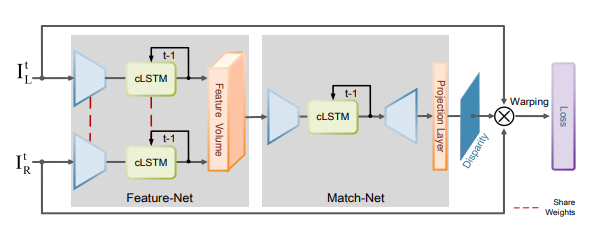

# Prerequisites of Odometry

1. **Rectification**
    * Each pixel's match in another image can only be found on a line called the epipolar line.
    * Even with high-precision equipment, image rectification is usually performed because it may be impractical to maintain perfect coplanarity between cameras.
2. **Edge Preserving Filtering**
    * Laplacian of Gaussian filter ( LOG ) 
    * Difference of Boxes Filters: Shadow Suppression and Efficient Character Segmentation
3. **Correlation: Constructing Disparity**
    * We do not need to search the entire right image for a particular feature in the left image, We only need to search along the epipolar line.

# Papers and releated research 

Here we collect all the info on the papers on the course of achieving this project.

## Content

- [Stereo Matching with Color and Monochrome Cameras in Low-light Conditions](#stereo-matching-with-color-and-monochrome-cameras-in-low-light-conditions)
- [DSVO (Direct Stereo Visual Odometry)](#dsvo-direct-stereo-visual-odometry)
- [Open StereoNet](#open-stereonet)
- [Real-Time Stereo Visual Odometry for Autonomous Ground Vehicles](#real-time-stereo-visual-odometry-for-autonomous-ground-vehicles)
- [iResNet](#iresnet)

## Personal Views on the paper and its use

### [Stereo Matching with Color and Monochrome Cameras in Low-light Conditions](https://sunghoonim.github.io/assets/paper/CVPR16_RGBW.pdf)

> **Stereo matching framework with a color and monochrome image pair, designed to estimate an accurate depth map
under low-light conditions without additional light sources.**

*Multi-modal and multi-spectral imaging* approaches such as a color and infrared camera pair and cross-channel matching have been proposed. However, these approaches require high manufacturing cost and specialized hardware. Here they exploit the fundamental trade-off between color sensing capability and *light efficiency of color cameras and monochrome cameras*, respectively. Because *monochrome cameras* respond to all colors of light, they have much *better light efficiency than Bayer-filtered color cameras*.

#### Approach
1. First decolorize the color input image because two cameras have different spectral sensitivities and viewpoints.
2. Then, estimate disparities based on brightness constancy and edge similarity constraints,
3. Retain reliable correspondences with a left-right consistency check and aggregate them from all candidate decolorized images.
4. After that, this set of reliable correspondences is used to augment additional correspondences by iterative gain compensation and disparity estimation.
5. To achieve robust stereo matching results, we combine two complementary costs; the sum of absolute differences (SAD) as a brightness constancy measure and the sum of informative edges (SIE) as an edge similarity measure.
6. Given the grayscale input and aligned decolorized image, we match the brightness of the input image to the decolorized image by estimating a local gain map. Because our decolorization is performed to preserve the contrast distinctiveness of a color image, it can capture important local edges better than the grayscale input image, where edges may be ambiguous due to the mixing of spectral information. Therefore, this iterative process provides increases in the number of reliable correspondences.

-------
### [DSVO (Direct Stereo Visual Odometry)](https://arxiv.org/pdf/1810.03963.pdf)
> **First Camera determines Position while Second One corrects scale.**

This paper uses the concepts of [SVO: Fast Semi-Direct Monocular Visual Odometry](https://www.ifi.uzh.ch/dam/jcr:e9b12a61-5dc8-48d2-a5f6-bd8ab49d1986/ICRA14_Forster.pdf) and *corrects its scale using the stereo parameters of the two camera*. It *doesn’t implement or create stereo images or 3D images* so its rather fast and also uses time to time error correction using new KeyFrame formation which helps keep the number of tracked points to a high optimum rather than a low optimum. 

#### Advantages:
- Uses single camera for basic odometry so keeps the computation faster.
- The number of tracked points are kept under check in the KeyFrame so that we get a good scale.
- **No Feature tracking is done**. Rather the pixel intensity is used to match points which is way faster and doesn’t need implementation of feature tracking algorithms.
- The *second camera is only used for scale correction* so the data the system works on is computationally less so the system is fast.

   

#### Disadvantages:
- Mathematical function used are very complex to implement is Python as there are absence of libraries. *Levenberg-Marquardt* algorithm computer equivalent *g2o algorithm* is still not perfectly implemented in python.
- Intensity matching fails in high texture environments thus another system of Lucas-Kanade algorithm needs to be used for alignment which is heavy when systems contains lots of repeating heavy textures like in factories. 
- In case of drastic camera rotation a new Keyframe needs to be created and matched with old keyframe for pose estimation which might fail and lead to triangulation error if no two points in the scene match.(Needs camera with high FOV)

-------
### [Open StereoNet](https://arxiv.org/pdf/1808.03959v1.pdf)
> **Using RNNs to use the temporal Information**

In this paper, they propose a novel **Recurrent Neural Network (RNN)** that takes a continuous (possibly previously unseen) stereo video as input, and directly predicts a depth-map at each frame *without a pre-training process*, and *without the need of ground-truth depth-maps* as supervision.

#### Problems with existing State of the Art algorithms:
- Most of the existing deep stereo matching methods are supervised learning based methods, for which the training process demands massive annotated training samples. In the context of stereo matching, getting large amount of training data (i.e.ground-truth disparity/depth maps) is an extremely expensive task.
- Applicability in real-world scenarios are fundamentally limited by their generalization ability: like most data-driven methods, they only work well on testing data that are sufficiently similar to the training data
- So far, most deep stereo matching methods exclusively focus on processing single pair of stereo images in a frame-by-frame manner, while in real world stereo camera captures continuous video. The rich temporal information contained in the stereo video has not been exploited to improve the stereo matching performance or robustness. 

> **Lacking Implementation details but good approach**

Starting from inputted *left and right images* at time **t**, the information processing flow in our network is clear:
1. The Feature-Net acts as a convolutional feature extractor which extracts features from the left and right images individually. Note, Feature-Net for the left image and Feature-Net for the right image share the weights. 
2. The obtained feature maps are concatenated (with certain interleave pattern) into a 4D feature-volume. 
3. The Match-Net takes the 4D feature volume as input, and learns an encoder-decoder representation of the features. A projection layer (based on soft-argmin
4. within the Match-Net is applied to produce the 2D disparity map prediction. Finally, the loss function block employs the current estimated disparity map to warp the right image to the left view and compare the photometric warping loss as well as other regularization term, which is used to refine the network via backprop. 

-------
### [Real-Time Stereo Visual Odometry for Autonomous Ground Vehicles](https://www-robotics.jpl.nasa.gov/publications/Andrew_Howard/howard_iros08_visodom.pdf)

-------
### [iResNet](https://arxiv.org/pdf/1712.01039.pdf)
> **Learning Disparity without stereo matching**

This paper proposes a network architecture to *incorporate all steps of stereo matching*. The network consists of three parts. The first part *calculates the multi-scale shared features*. The second part performs matching cost calculation to *estimate the initial disparity using shared features*. The initial disparity and the *shared features are used to calculate the feature constancy* that measures correctness of the correspondence between two input images. The initial disparity and the feature constancy are then fed to a subnetwork to *refine the initial disparity*.

#### Advantages
- The paper proposes a neat network architecture with which can be easily implemented with full personal alterations possible for customization.
- Doesn’t require any kind of stereo parameters for matching and determining the disparity map.
- Uses CNN to achieve the steps of mathematical stereo matching compared to old methods which only relied on deep learning architecture to provide the final result.

#### Disadvantages
- Speed decreases exponentially as we start refining the disparity map so frame rate might reduce.
- Estimates Stereo matching features itself so might fail in high texture repeated pattern systems.
- Only achieves partial part of Odometry while taking a good chunk of time.
- System trained in one environment fails in new environment.

#### Ways to Overcome Disadvantages:
- Edit the network to maintain refinement while also reducing time.
- Try to use features estimated by the network layers as feature descriptors for the odometry system also so no need for other feature descriptor systems.

